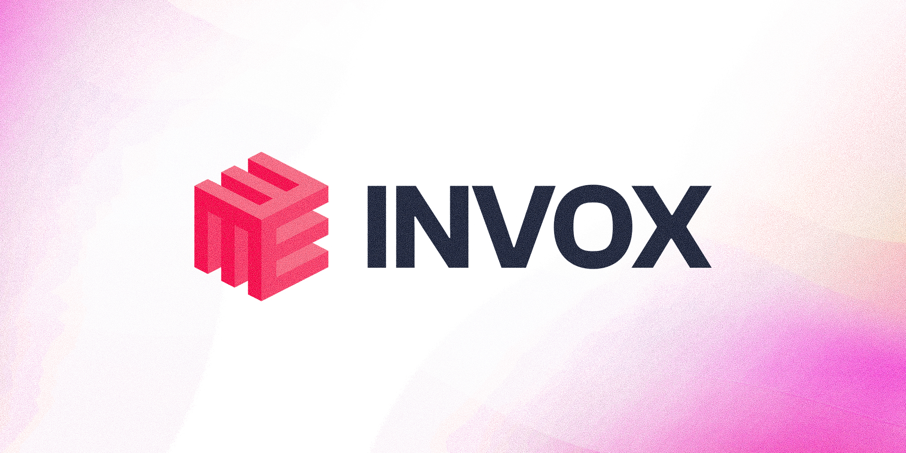

# Invox

**AI-powered invoice generator for freelancers, agencies, and small businesses.**

Invox combines a conversational AI assistant with a full-featured invoice editor — so you can go from a blank page to a polished, ready-to-send invoice in seconds. Describe what you need in plain language, or edit everything by hand. Either way, you own your data.

---

## Features

### Natural Language Invoice Editing

Tell the AI what you want in plain English:

> "Create a web design invoice for Acme Corp with 3 milestones totaling $6,500"
> "Add a 10% discount and change the template to something more minimal"
> "Update the due date to end of month and add late payment terms"

The AI reads your current invoice, calls the right tools, and streams changes back in real time. Multi-turn conversations remember context across messages — no need to repeat yourself.

### 12 Professional Templates

Standard, Modern, Minimal, Classic, Elegant, Bold, Corporate, Creative, Startup, Receipt, Gradient, and Retro. Each template is fully implemented with its own header layout and supports complete color, font, and spacing customization.

### Three Ways to Edit

- **AI Chat** — Describe changes conversationally. The agent handles the rest.
- **Settings Panel** — Tabbed sidebar for branding, typography, financials, and layout.
- **Inline Editing** — Click any field on the invoice to edit it directly.

### PDF Export

One-click export at print-ready resolution (816×1056px). Fonts, colors, and layout are preserved exactly as they appear on screen.

### Signature Support

Add a text signature or draw one by hand using a pressure-sensitive canvas. Both are stored and rendered on the invoice.

### Local-First Data

All invoice data is stored in your browser's localStorage. No account, no server-side storage, no data leaving your machine (except AI requests to OpenAI).

---

## Getting Started

**Prerequisites:** Node.js 18+, an OpenAI API key

```bash
git clone https://github.com/aasherkamal216/Invox.git
cd Invox
npm install
```

Create a `.env.local` file in the project root:

```env
OPENAI_API_KEY=sk-your-key-here
```

Start the development server:

```bash
npm run dev
```

Open [http://localhost:3000](http://localhost:3000).

---

## Commands

```bash
npm run dev      # Start dev server (hot reload)
npm run build    # Production build
npm run start    # Run production server
npm run lint     # ESLint
```

---

## Tech Stack

| Layer | Technology |
|-------|-----------|
| Framework | Next.js 16 (App Router) |
| Language | TypeScript 5 |
| Styling | Tailwind CSS v4 |
| Components | Coss UI (Base UI + Tailwind) |
| AI | OpenAI Agents SDK (`@openai/agents`) |
| PDF | jsPDF + html-to-image |


The AI agent runs entirely server-side via a Next.js Route Handler. The client sends a message and the current invoice state; the server responds with a Server-Sent Events stream of text deltas and invoice patches.

---

## Contributing

Issues and pull requests are welcome. For detailed architectural notes and development conventions, see [CLAUDE.md](./CLAUDE.md).

1. Fork the repository
2. Create a feature branch (`git checkout -b feat/my-feature`)
3. Commit your changes
4. Open a pull request

---

## Known Limitations

- Invoices are stored locally only — no cross-device sync
- No user authentication or multi-user support
- The AI agent cannot upload logos, draw signatures, or customize label strings (these are UI-only actions)

---

## License

MIT — see [LICENSE](./LICENSE) for details.